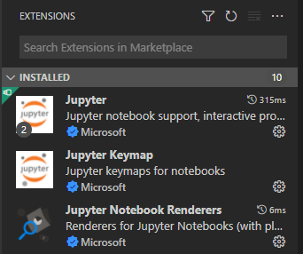
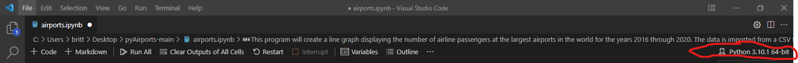
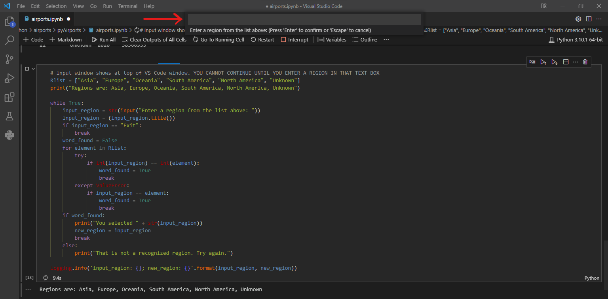

# pyAirports - because we still can't travel as much as we want!
Python airports project for Code Louisville in spring 2022.

Data source: https://www.kaggle.com/khaiid/most-crowded-airports

This project includes data for the most crowded airports around the world. The user selects a region of interest (from a list provided) and the program auto-generates a line graph showing total number of passengers for airports in that region by year. Project includes a dictionary and a list, as well as a While loop.

## Start-up instructions

Before starting, you need to download/install the following extensions in VS Code for Jupyter Notebook:

Clone the repo to your computer. 

Package requirements are listed in the requirements.txt file. Install the libraries in the requirements.txt file using the following command:

`pip install -r requirements.txt`

Packages include:
- Pandas
- numpy
- matplotlib
- logging
- sys

Navigate to the folder and open airport.ipynb with VS Code. Be sure to update the kernel in the upper right of VS Code (as shown in the screenshot below).The file import uses a public CSV saved in Google Sheets, a work around for users utilizing different operating systems (not having to adjust the import statement/file path).
## Important - be sure to update the kernel to the venv you are using in the upper right corner of VS Code (screenshot for assistance below):

Also important to note: When you run the code block to input a region, the input box will show up at the top of the VS Code window. The code block will show as still running until you enter a region. You cannot continue to run the program until you enter a region in the input box: 

## Let's talk project requirements:
Features used:
* Category 1: Create a dictionary or list, populate it with several values, retrieve at least one value, and use it in your program.

     * Used dictionary to assign "Region" to each observation
     * Used list to create values to check in while loop
      
* Category 2: Read data from an external file, such as text, JSON, CSV, etc, and use that data in your application.

     * Imported CSV file (permanent, public location on Google Sheets/Drive)
      
* Category 3: Visualize data in a graph, chart, or other visual representation of data.

     * Line graph showing total number of passengers for selected region by year.

* Category 4:

     * Implement a log that records errors, invalid inputs, or other important events and writes them to a text file.
     * Document library dependencies in a requirements.txt file.

* Additional features:
  
     * Use a Jupyter notebook to document your data analysis.
     * Use pandas, matplotlib, and/or numpy to perform a data analysis project. Ingest 2 or more pieces of data, analyze that data in some manner, and display a new result to a graph, chart, or other display.
